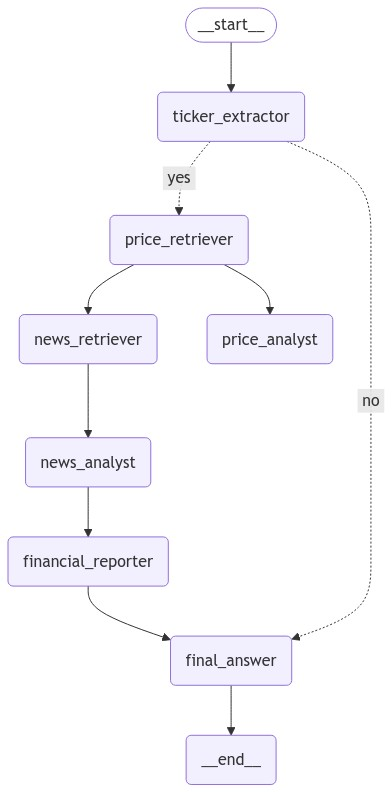

# Financial Advice Agent

Financial Advice Agent is an AI-powered assistant built using LangGraph. It provides financial insights by analyzing cryptocurrency prices and relevant news articles. The architecture is designed for modularity and efficiency, leveraging AI-powered tools for extracting, retrieving, analyzing, and reporting financial data.

## Architecture Overview

### The workflow of the Financial Advice Agent is as follows:
	1.	Ticker Extractor: Identifies cryptocurrency tickers from the input.
	2.	Price Retriever: Fetches the latest cryptocurrency prices for the extracted ticker(s).
	3.	News Retriever: Gathers relevant news articles for the specified cryptocurrency ticker(s).
	4.	News Analyst: Analyzes the retrieved news to extract meaningful insights.
	5.	Price Analyst: Assesses cryptocurrency price trends and patterns.
	6.	Financial Reporter: Combines insights from news and price analysis to generate a comprehensive financial summary.
	7.	Final Answer: Delivers the final financial report or advice to the user.


For detailed architecture, refer to the diagram included in this repository.

## Features
	•	Extracts cryptocurrency tickers from user input.
	•	Retrieves real-time cryptocurrency price data.
	•	Analyzes relevant financial news articles.
	•	Provides actionable insights based on price trends and news analysis.
	•	Generates comprehensive financial reports.

## Setup Instructions

### Prerequisites
	•	Python 3.10.11
	•	Ensure you have pip installed.

### Installation
	1.	Clone the repository:
```
git clone <repository_url>
cd Financial-advice-agent
```

	2.	Install the required dependencies:
```
pip install -r requirements.txt

```
	3.	Run the Streamlit application:
```
streamlit run main.py
```


## Usage
	1.	Open the application in your browser (usually runs on http://localhost:8501).
	2.	Enter the cryptocurrency ticker or financial query in the input field.
	3.	View the AI-generated insights, analysis, and financial advice.

## Project Dependencies

All dependencies are listed in the requirements.txt file. These include:
	•	LangGraph (for workflow orchestration)
	•	Streamlit (for the user interface)
	•	Other essential libraries for data retrieval, NLP, and analysis

## Folder Structure

.
├── main.py                 # Entry point for the Streamlit app
├── requirements.txt        # Project dependencies
├── README.md               # Project documentation
├── utils/                  # Helper functions and utilities
├── models/                 # AI models and analysis scripts
└── assets/                 # Architecture diagram and other resources
